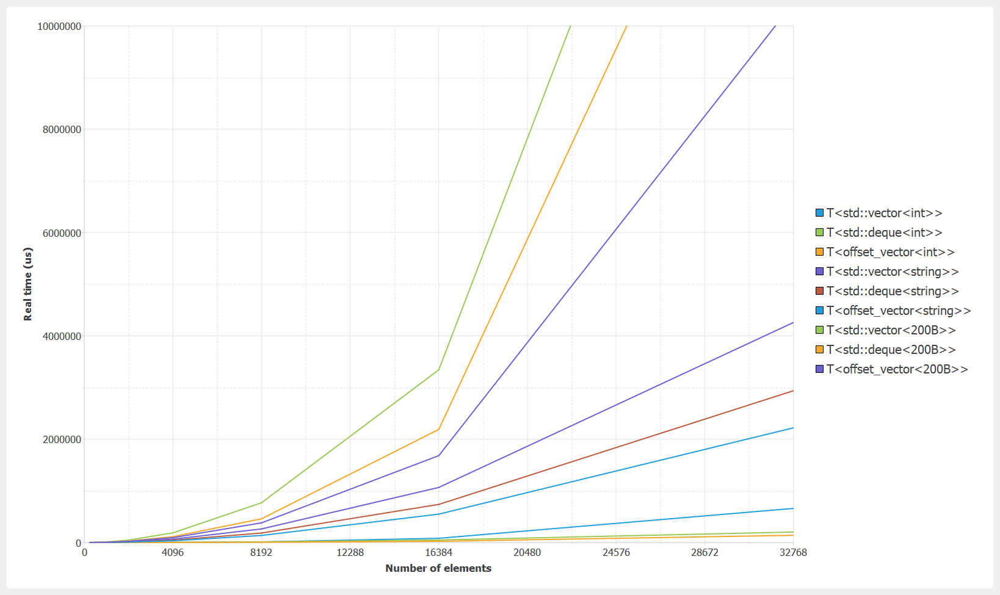
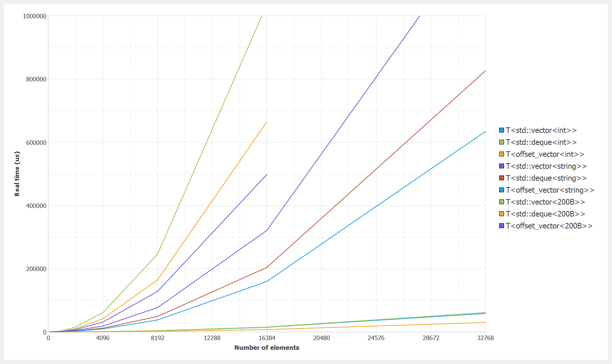
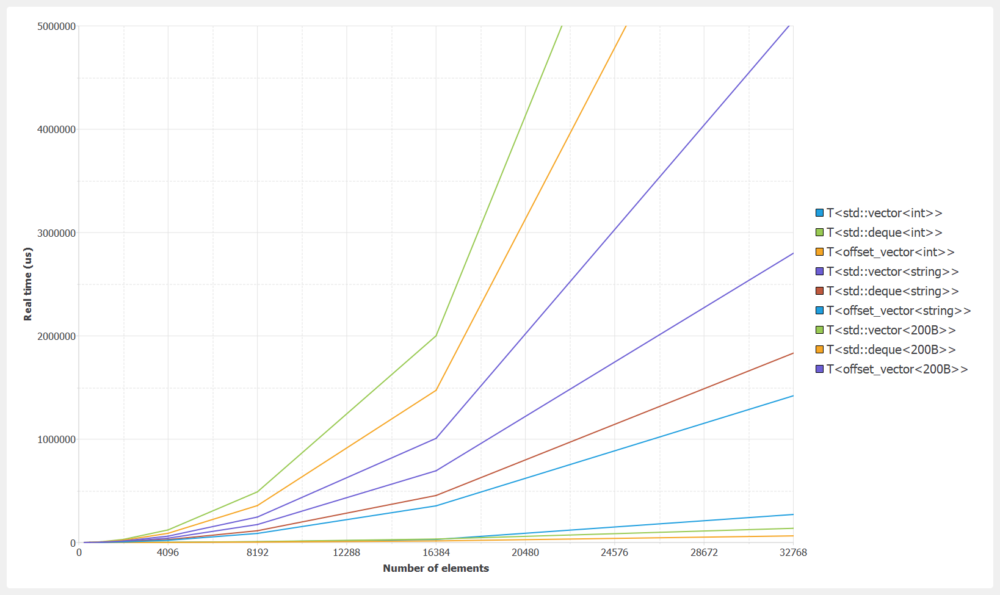

# Indivi-Collection

A collection of std-like containers written in C++.

Includes Google Benchmark and Google Test support.

### Categories

- `devector` (double-ended vector)
	- a sequence, contiguous and reversible container (with basic exception safety)
	- with dynamically allocated and automatically handled storage
	- similar to std::vector except it features an optional 'offset', allowing front data manipulation
		- example representation:  |\_|a|b|\_|\_|  (with size=2, capacity=5, offset=1)
	- options (see 'devector.h' for more details):
		- reallocation position mode (start, center, end)
		- data shift mode (near, center, far)
		- growth factor
		- data-construct (default Vs value) (avoid unnecessary memory initialization)
	- complexity:
		- random access - constant 𝓞(1)
		- remove at start/end - constant 𝓞(1)
		- insert at start/end - amortized constant 𝓞(1), or 𝓞(N) if size < capacity and start == startOfStorage/end == endOfStorage
		- insert/remove - linear in the distance to the closest between start and end 𝓞(N/2)

### Benchmark results

Benchmark configuration:
- OS: Windows 10 64-bits
- Compiler: MinGW 8.1.0 64-bits
- Flags: -O2 -DNDEBUG -march=native -mtune=native
- CPU: i7-10875h (L1-D 32K, L1-I 32K, L2 256K, L3 16M)
- Parameters: see 'benchmark_devector.h'

#### Erase random

#### Insert random (with realloc mode = center)

#### Erase-Insert random

### Dependencies

This project uses git submodule to include Google Benchmark and Google Test repositories:

    $ git clone https://github.com/gaujay/indivi_collection.git
    $ cd indivi_collection
    $ git submodule init && git submodule update
    $ git clone https://github.com/google/googletest lib/benchmark/googletest

### Building

Support GCC/MinGW and MSVC (see 'CMakeLists.txt').

You can open 'CMakeLists.txt' with a compatible IDE or use command line:

    $ mkdir build
    $ cd build
    $ cmake ..
    $ make <target> -j

### License

Apache License 2.0
