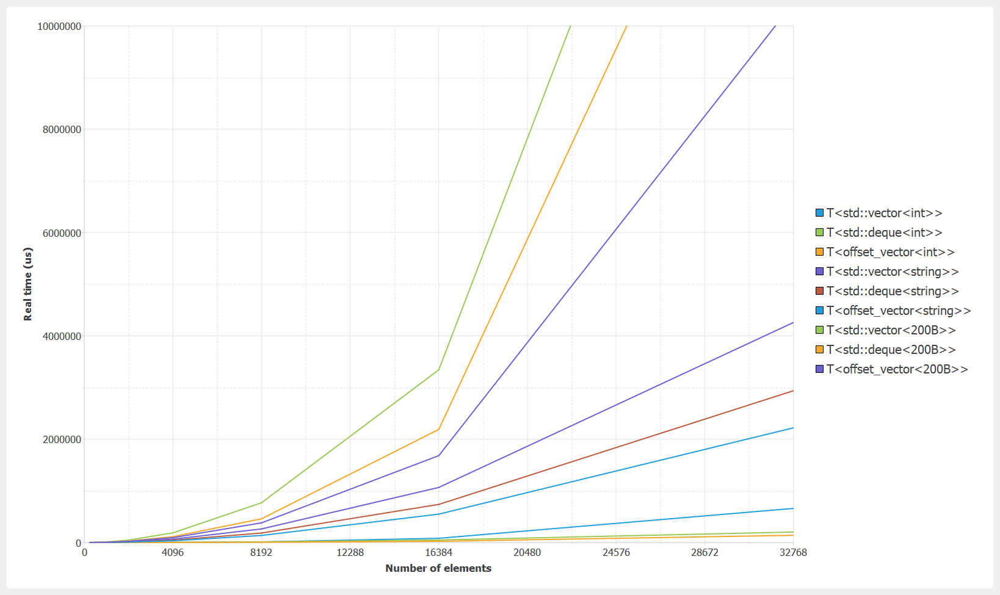
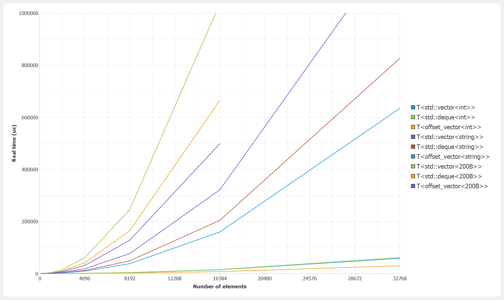
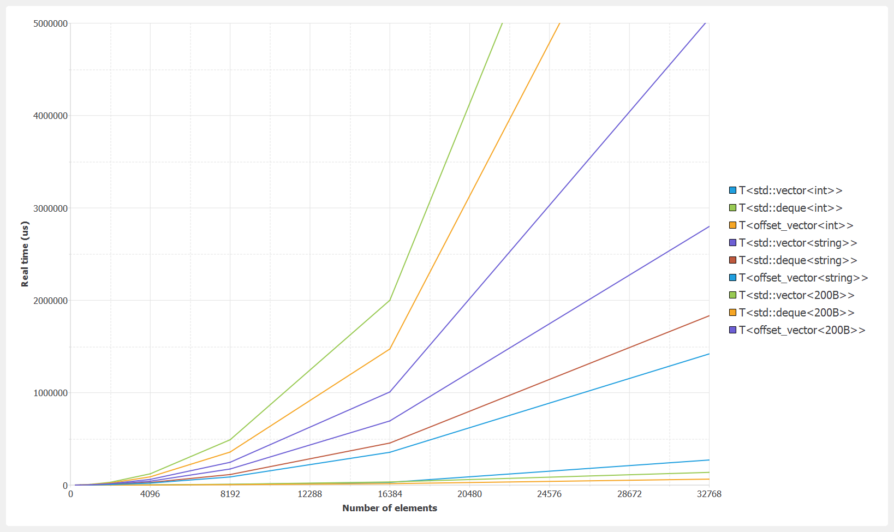

# Devector

A double-ended vector, with customizable policies for reallocation and data-shift positioning.
For details, see 'devector.h'.

### Benchmark results

Benchmark configuration:
- OS: Windows 10 64-bits
- Compiler: MinGW 8.1.0 64-bits
- Flags: -O2 -DNDEBUG -march=native -mtune=native
- CPU: i7-10875h (L1-D 32K, L1-I 32K, L2 256K, L3 16M)
- Parameters: see 'benchmark_devector.h'

#### Erase random

#### Insert random (with realloc mode = center)

#### Erase-Insert random

