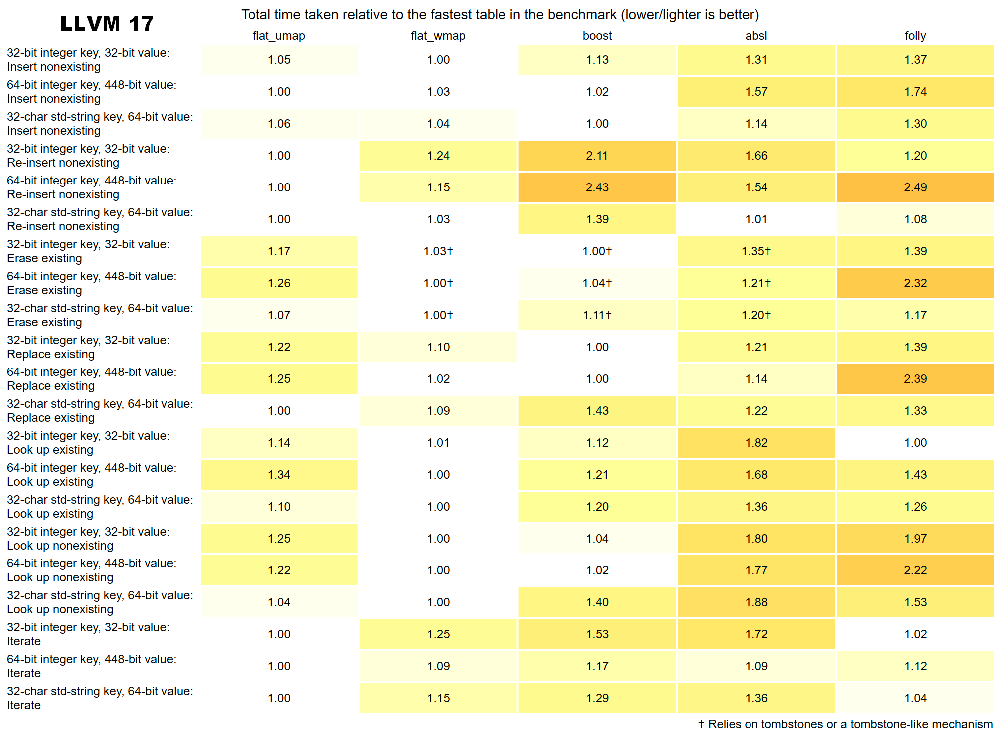
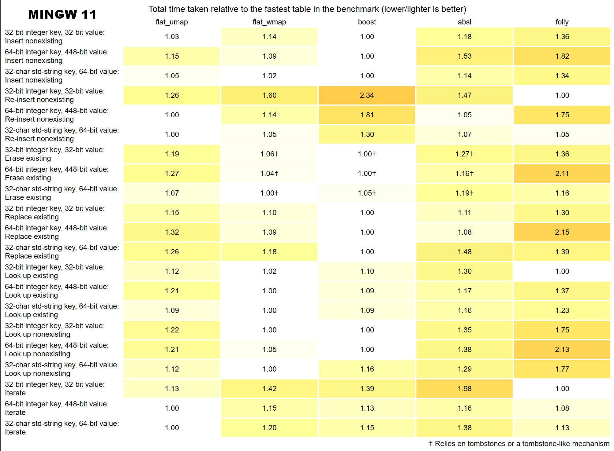
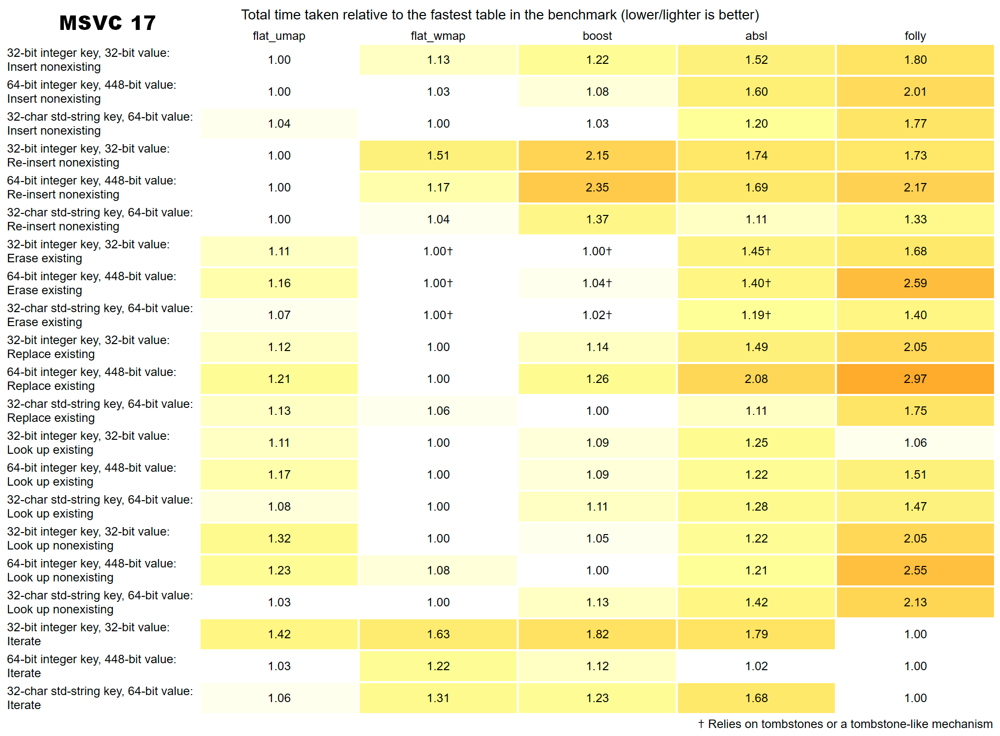

# Flat_unordered

Flat unordered maps/sets, based on open-addressing and SIMD instructions, with or without tombstones.
For details, see `flat_umap.h`, `flat_uset.h` and `flat_wmap.h`, `flat_wset.h`.

This benchmark suite is based on the great work by Jackson Allan:
https://github.com/JacksonAllan/c_cpp_hash_tables_benchmark

With some minor updates:
https://github.com/gaujay/c_cpp_hash_tables_benchmark

Change notes:
- Only unordered maps are tested, but sets are expected to behave similarly
- An additional benchmark was added ("re-insert after erase all") to showcase the effects of tombstones
- Data type of long std::string (32-chars, no sso) replaces original c-string one.
- Folly `F14ValueMap` was also added for comparison, as another SIMD based flat map without tombstones
- Containers are benchmarked with their default hash function (instead of custom hash murmur3/FNV-1a)

### Benchmark results

Benchmark configuration:
- OS: Windows 11 x64
- Compilers: LLVM Clang 17.06, MinGW 11.2.0, MSVC 17.14.6
- Flags: -O3 -DNDEBUG -static -march=native -mtune=native (or /O2 /DNDEBUG /GL)
- CPU: i7-10875h (L1-D 32K, L1-I 32K, L2 256K, L3 16M)

Libraries versions:
- [Abseil](https://github.com/abseil/abseil-cpp) `flat_hash_map` v2024.01.16.2
- [Boost](https://www.boost.org/doc/libs/1_85_0/libs/unordered/doc/html/unordered.html) `unordered_flat_map` v1.85.0
- [Folly](https://github.com/facebook/folly/blob/main/folly/container/F14.md) `F14ValueMap` v2024.08.05.0
- [Ankerl](https://github.com/martinus/unordered_dense) `unordered_dense` v4.1.2

#### LLVM 17

[Detailed graphs](../../docs/flat_unordered/flat_unordered_llvm17.html)

#### MinGW 11

[Detailed graphs](../../docs/flat_unordered/flat_unordered_mingw11.html)

#### MSVC 17

[Detailed graphs](../../docs/flat_unordered/flat_unordered_msvc17.html)
