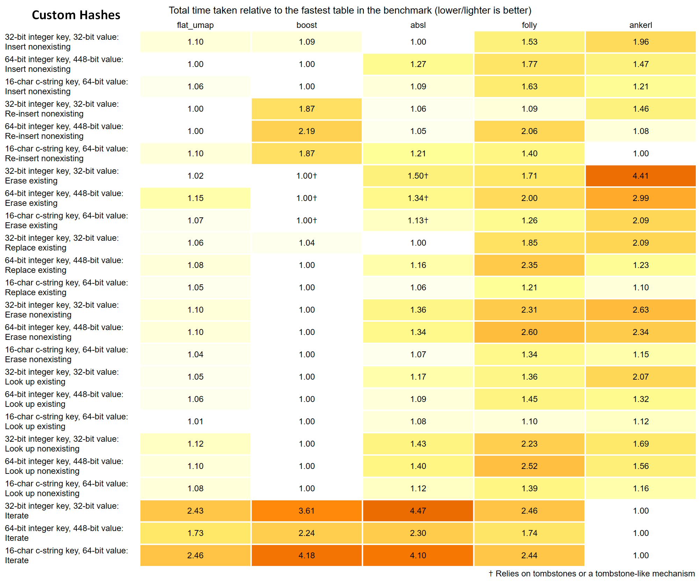
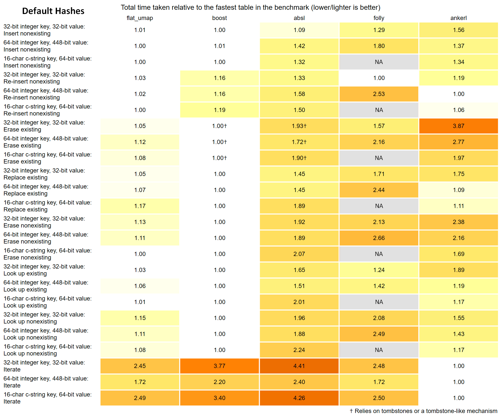

# Flat_unordered

A flat unordered map/set without tombstones, based on open-addressing and simd instructions.
For details, see `flat_umap.h` and `flat_uset.h`.

This benchmark suite is based on the great work by Jackson Allan:
https://github.com/JacksonAllan/c_cpp_hash_tables_benchmark

Notes:
- Only unordered maps are tested, but sets are expected to behave similarly
- An additional benchmark was added ("re-insert after erase all") to showcase the effects of tombstones
- Folly `F14ValueMap` was also added for comparison, as another simd based flat map without tombstones
- Containers are benchmarked twice: once with their default hash function, once with a custom hash (murmur3/FNV-1a)

### Benchmark results

Benchmark configuration:
- OS: Windows 10 64-bits
- Compiler: LLVM Clang 17.06
- Flags: -O3 -DNDEBUG -static
- CPU: i7-10875h (L1-D 32K, L1-I 32K, L2 256K, L3 16M)

Libraries versions:
- [Abseil](https://github.com/abseil/abseil-cpp) `flat_hash_map` v2024.01.16.2
- [Boost](https://www.boost.org/doc/libs/1_85_0/libs/unordered/doc/html/unordered.html) `unordered_flat_map` v1.85.0
- [Folly](https://github.com/facebook/folly/blob/main/folly/container/F14.md) `F14ValueMap` v2024.08.05.0
- [Ankerl](https://github.com/martinus/unordered_dense) `unordered_dense` v4.1.2

#### Custom hashes

[Detailed graphs](../../docs/flat_unordered/flat_umap_custom_hash.html)

Note: the custom hash sees `const char*` as strings in these benchmarks

#### Default hashes

[Detailed graphs](../../docs/flat_unordered/flat_umap_default_hash.html)

Note: Folly default hash sees `const char*` as strings instead of pointers, so benchmark results are not comparable in these cases
