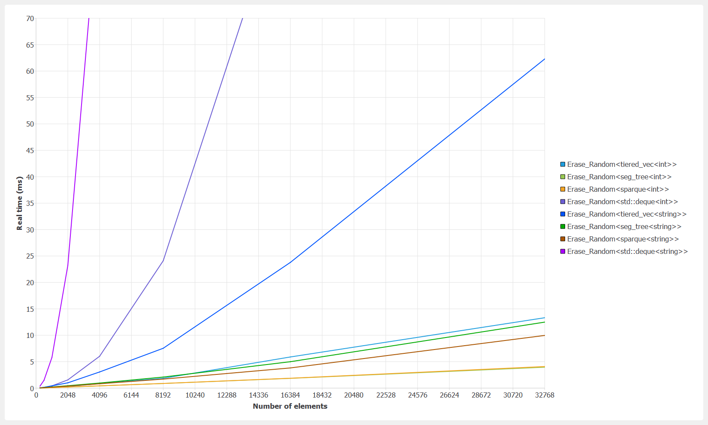
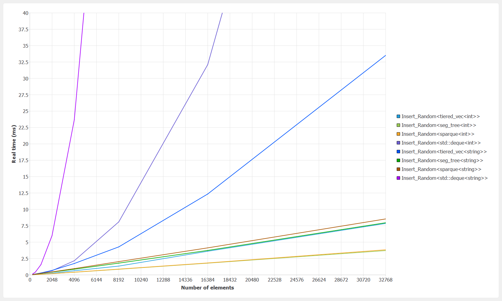
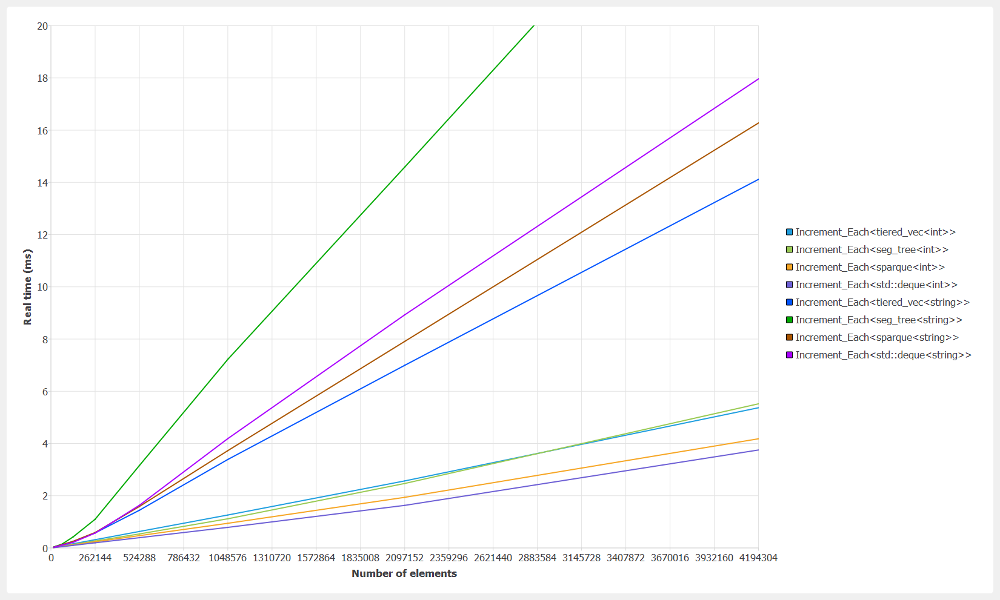
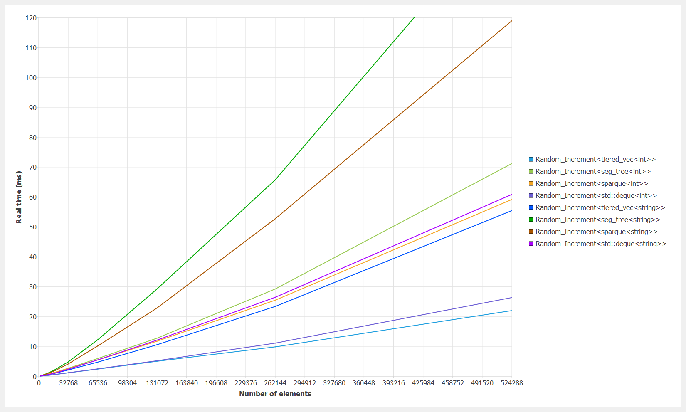
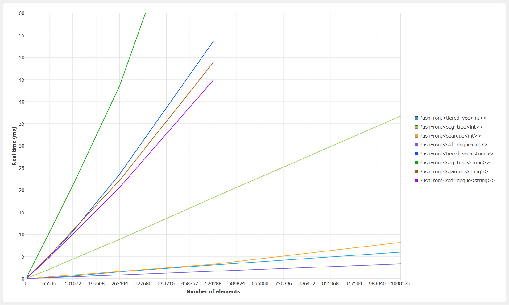
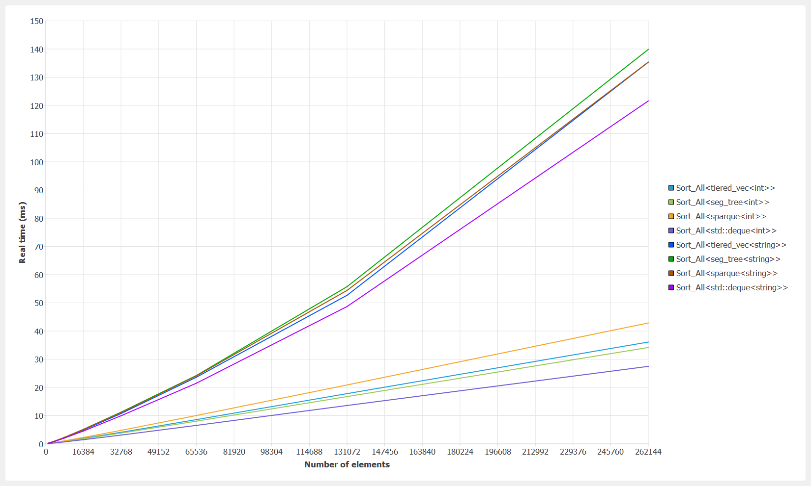

# Sparque

A sparse deque, based on a counted B+ tree with customizable chunk and nodes sizes.
For details, see 'sparque.h'.

### Benchmark results

Benchmark configuration:
- OS: Windows 10 64-bits
- Compiler: MinGW 8.1.0 64-bits
- Flags: -O2 -DNDEBUG -march=native -mtune=native
- CPU: i7-10875h (L1-D 32K, L1-I 32K, L2 256K, L3 16M)
- Parameters: see 'benchmark_sparque.h'

#### Erase random

#### Insert random

#### Increment each

#### Increment random

#### Push front

#### Sort

